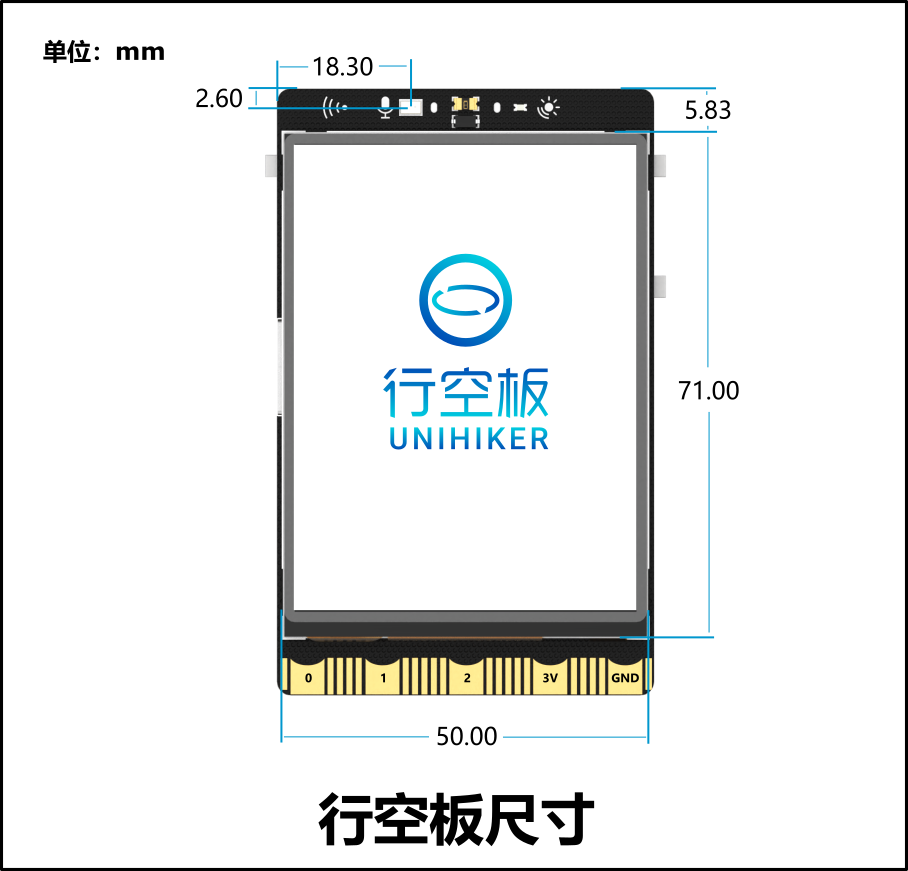
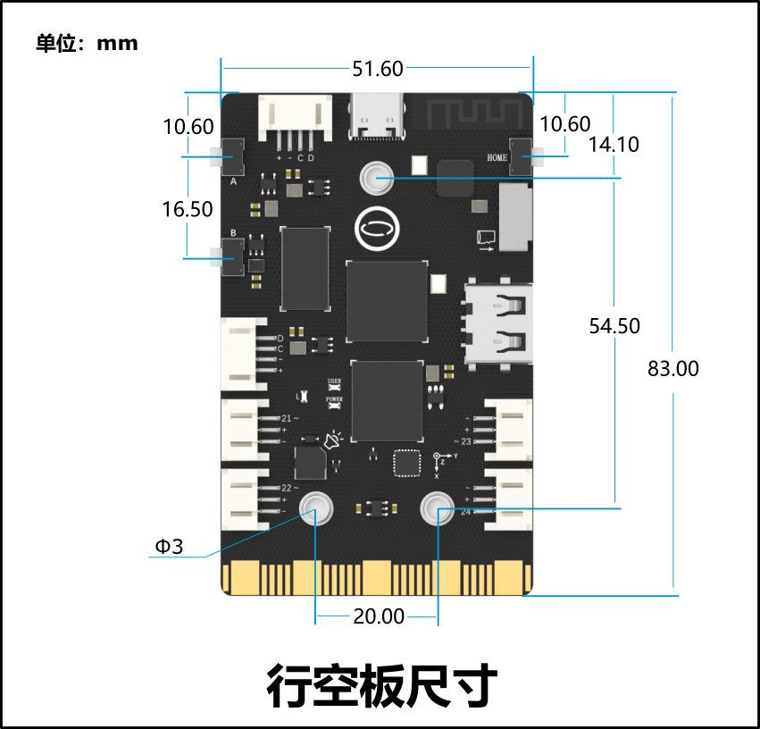
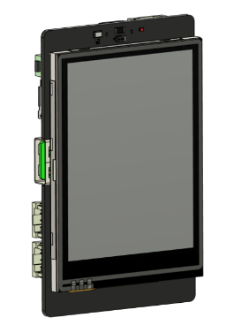

# 结构件制作教程 — 从零开始独立完成

> 比赛评分中「结构设计」占 **20%**（工业设计15%+艺术表现力5%）
> 本文教你从测量→设计→切割/打印→组装，每一步都有详细图解

---

## 一、行空板M10 精确尺寸（做外壳第一步）





### 必须保留的开口

| 开口位置 | 用途 | 建议尺寸 | 说明 |
|----------|------|----------|------|
| 屏幕窗口(正面) | 露出触摸屏 | 52×38mm | 让出触摸操作区域 |
| 光线传感器孔(正面左上) | 检测环境光 | φ3mm | 屏幕左上角小圆孔 |
| 麦克风孔(正面右上) | 录音/音量检测 | φ2mm | 屏幕右上角 |
| A/B/Home键位(正面下方) | 按键操作 | 5×10mm 长条 | 对应三个按键位置 |
| USB-C口(下边) | 供电/编程 | 10×6mm 矩形 | 板子下边缘 |
| USB-A口(下边) | 插摄像头/U盘 | 14×8mm 矩形 | USB-C旁边 |
| 散热孔(背面) | 散热 | φ3mm ×6个 | 芯片位置上方 |
| 传感器走线孔(侧面) | 外接传感器 | 10×5mm×2个 | 左右各一个 |

### 固定方式

```
M10背面有 3 个 M3 螺丝孔（呈三角形分布）：
  螺丝孔距板边：约 5mm
  推荐：M3×6 铜螺柱 + M3×4 螺丝固定
  螺柱高度 ≥ 5mm（给背面排线留空间）
```

---

## 二、激光切割——LaserMaker 手把手教程

### 2.1 软件界面认识

LaserMaker 主界面分为：
- **左侧**：工具面板（矩形/圆/文字/图片等）
- **中间**：绘图区域（白底网格）
- **右侧**：属性面板（尺寸/颜色/位置）
- **顶部**：菜单栏（文件/编辑/视图/一键造物等）

### 2.2 一键造物——5 分钟出盒子

**这是最快的方法，适合零基础。**

```
操作步骤（每一步都有对应按钮）：
┌──────────────────────────────────────────┐
│ Step 1: 打开 LaserMaker                  │
│ Step 2: 点击顶部菜单「一键造物」          │
│ Step 3: 选择「盒子」                     │
│ Step 4: 输入参数：                       │
│    长(L): 100mm  ← 内部长度              │
│    宽(W): 70mm   ← 内部宽度              │
│    高(H): 45mm   ← 内部高度              │
│    板厚: 3mm     ← 奥松板标准厚度         │
│    榫卯: T型卡口  ← 默认即可              │
│    盒子类型: 封闭盒子                      │
│ Step 5: 点击「确定」                      │
│ Step 6: 软件自动生成 6 块板子的展开图     │
│    (底板/顶板/前/后/左/右侧板)            │
│ Step 7: 用鼠标拖拽调整各板位置            │
│ Step 8: 保存 → 导出 DXF                  │
└──────────────────────────────────────────┘
```

**关键参数如何确定**：
```
盒子内部尺寸 = 要装进去的设备尺寸 + 10mm 余量
  行空板M10：约 78×52mm → 盒子内部取 88×62mm
  Arduino UNO：约 68×53mm → 盒子内部取 78×63mm
  同时装：取 120×80mm

材料厚度：用 3mm 奥松板（比赛现场最常用）
```

### 2.3 手动加开孔——放传感器和接口

**如果你生成的盒子没有开孔，按以下步骤手动加**：

```
Step 1: 选择「矩形」工具
Step 2: 在屏幕窗口位置画一个 52×38mm 的矩形
Step 3: 选中矩形 → 右侧「颜色」选红色(切割线)
Step 4: 用鼠标拖动矩形到盒子顶板的对应位置
Step 5: 同样方法画 USB-C 口(10×6mm)、USB-A口(14×8mm)
Step 6: 选择「圆形」工具画散热孔(φ3mm)

⚠ 被红色框住的区域会在切割时镂空，
  被蓝色填充的区域是雕刻（不会切穿）
```

### 2.4 图片雕刻——把logo或图案刻在盒子上

**用美图秀秀预处理图片**：
```
1. 打开图片 → 选择「抠图」→「自动抠图」
2. 在要保留的区域画绿线 → 点「完成抠图」
3. 选择「特效」→「艺术」→「素描」
4. 调整参数到满意 → 保存为 PNG
5. 把保存的图片拖入 LaserMaker 设计区
6. 选中图片 → 右侧颜色选「蓝色」(雕刻)
7. 拖动四个角的控点调整大小
```

### 2.5 颜色设置——决定哪部分切割、哪部分雕刻

```
┌────────────┬──────────┬──────────────────────────┐
│  线条颜色  │  激光动作  │  用途                    │
├────────────┼──────────┼──────────────────────────┤
│  红色/黑色  │  切割    │  切穿板材，分出零件     │
│  蓝色      │  雕刻    │  在表面刻出痕迹，不切穿 │
│  绿色      │  浅雕    │  比雕刻更浅              │
└────────────┴──────────┴──────────────────────────┘

操作方法：框选线段/图片 → 右侧颜色面板点击对应颜色
```

### 2.6 切割参数设置（关键！）

| 材料 | 厚度 | 切割功率 | 切割速度 | 雕刻功率 | 雕刻速度 |
|------|------|----------|----------|----------|----------|
| 奥松板 | 3mm | 55-65% | 18-22mm/s | 18-22% | 180-220mm/s |
| 亚克力 | 3mm | 70-80% | 12-16mm/s | 20-25% | 200-250mm/s |
| 瓦楞纸 | 3mm | 30-40% | 30-40mm/s | 15-18% | 250-300mm/s |

**⚠ 先试切！** 在角落切一个小正方形，确认功率速度合适再切全部。

### 2.7 榫卯结构——不用螺丝也能牢固拼接

创意智造培训/数字技术3_Mind+_行空板K10(项目备忘)/资料及素材/00接线图1.png)

**什么是榫卯**：一块板的凸起(公榫)插入另一块板的槽(母槽)，靠卡口咬合固定。

**LaserMaker 自动生成的榫卯**已经帮你做好了，不需要手动设计。

**如果你想手动加卡口**：
```
1. 打开配套文件「PXQ榫卯卡口.lcpx」
2. 里面有多套不同尺寸的卡口模板
3. 框选需要的卡口 → Ctrl+C 复制 → Ctrl+V 粘贴到你的设计
4. 用「对齐工具」使卡口居中
5. 母卡口放在主板边缘，公卡口放在拼接板边缘
```

📂 [榫卯卡口库文件](file:///Users/liboning/Desktop/科创比赛相关/学校比赛/2026诸暨备赛/2025年9月-2026年7月(国%20省%20市)创意智造培训/数字技术1_结构件制作备忘/1_2-PXQ榫卯卡口.lcpx)
📂 [参考案例-智慧护眼精灵.lcpx](file:///Users/liboning/Desktop/科创比赛相关/学校比赛/2026诸暨备赛/2025年9月-2026年7月(国%20省%20市)创意智造培训/数字技术1_结构件制作备忘/1_3-结构件设计参考案例_智慧护眼精灵.lcpx)

### 2.8 实际切割操作流程

```
现场操作（在工具区的激光切割机前）：
┌────────────────────────────────────────────────┐
│ 1. 把U盘插入切割机电脑                          │
│ 2. 打开你的设计文件(LaserMaker格式或DXF)        │
│ 3. 确认每条线的颜色正确(红=切割,蓝=雕刻)        │
│ 4. 把3mm奥松板放入切割机平台                   │
│ 5. 调整激光头到板材上表面焦距                    │
│ 6. 在软件中框选要切割的部分                     │
│ 7. 设置参数：奥松板3mm → 功率60% 速度20mm/s    │
│ 8. 先切一个10×10mm小方块测试                   │
│ 9. 确认切穿后 → 正式切割                       │
│ 10. 等待切割完成 → 取件                        │
│ 11. 用砂纸打磨毛边 → 拼装                     │
└────────────────────────────────────────────────┘
```

### 2.9 可用材料对比

| 材料 | 厚度 | 特点 | 切割难度 | 适合 |
|------|------|------|----------|------|
| **奥松板** | 3mm | 最常用、便宜、易切 | ★ | 外壳主体 |
| 胶合木板 | 3mm | 强度更高，木纹好看 | ★ | 承重结构 |
| 亚克力 | 3mm | 透明/彩色，水口锋利 | ★★ | 透明窗口/装饰 |
| 双色板 | 1.5mm | 表面雕刻效果突出 | ★ | 铭牌/面板 |
| 瓦楞纸 | 3mm | 耗材包提供，便宜 | ★ | 快速原型 |
| 卡纸 | 1mm | 精细雕刻 | ★ | 模板/薄片 |

---

## 三、3D 打印——Blender 基础教程

### 3.1 为什么用 3D 打印？

激光切割只能做平面的盒子（2D→3D组装），3D 打印可以做任意立体形状，比如：
- 异形外壳（流线型、圆角过渡）
- 传感器支架（卡扣式安装）
- 连接件（X/Y/Z 三个方向的连接）
- 按钮帽/旋钮

**比赛策略**：大的外壳用激光切割（快），小零件用 3D 打印（精细）。3D 打印一个小零件约 30 分钟~1 小时。

### 3.2 Blender 基础操作（只需要用到这些）

**下载 Blender**（免费，约 400MB），打开后是一个 3D 场景。

**最重要的快捷键**（划重点）：

| 操作 | 快捷键 | 作用 |
|------|--------|------|
| 旋转视角 | 鼠标中键按住拖拽 | 从各个角度观察模型 |
| 平移视角 | Shift + 中键拖拽 | 移动视野 |
| 缩放 | 鼠标滚轮 | 拉近拉远 |
| 选中物体 | 左键点击 | 物体高亮黄色=选中 |
| 移动 | 按 G（Grab） | 然后拖拽鼠标移动 |
| 旋转 | 按 R（Rotate） | 然后拖拽鼠标旋转 |
| 缩放 | 按 S（Scale） | 然后拖拽鼠标缩放 |
| 挤出 | 按 E（Extrude） | 拉出一个新的面 |
| 删除 | X 键 | 弹出删除菜单 |

### 3.3 从零开始做一个传感器支架

```
目标：做一个 30×20×10mm 的支架，用来固定 DHT11 传感器

操作步骤：
┌─────────────────────────────────────────────────────┐
│ Step 1: 打开 Blender → 新建项目                       │
│ Step 2: 删除默认的立方体（选中→X→Delete）            │
│ Step 3: Shift+A → Mesh → Cube （新建一个立方体）     │
│ Step 4: 按 S → 在 X 方向输入 0.03 → Enter          │
│         （缩放到 30mm 宽，注意 Blender 默认1单元=1米）│
│ Step 5: 按 S → 在 Y 方向输入 0.02 → Enter           │
│ Step 6: 按 S → 在 Z 方向输入 0.01 → Enter           │
│         （现在是一个 30×20×10mm 的扁方块）            │
│ Step 7: 按 Tab 进入编辑模式                          │
│ Step 8: 按 3 切换到面选模式（选面）                  │
│ Step 9: 点击顶面→按 E→移动鼠标→输入 0.005→Enter     │
│         （挤出 5mm 高的凸台，放传感器在上面）         │
│ Step 10: 按 Tab 退出编辑模式                         │
│ Step 11: File → Export → STL → 保存                 │
└─────────────────────────────────────────────────────┘
```

### 3.4 关键设计规范

| 项目 | 最小值 | 推荐值 | 说明 |
|------|--------|--------|------|
| 壁厚 | 1.2mm | 2mm | 太薄会碎裂 |
| 悬空角度 | >45° 须加支撑 | <45° 不用 | 超过45°的悬空要加支撑 |
| 连接件间隙 | 0.2mm | 0.3mm | 两个零件配合时的空隙 |
| M3螺丝孔 | 3.0mm | 3.2mm | 比螺丝大0.2mm |
| 层高 | 0.2mm(精细) | 0.3mm(快速) | 比赛时间紧就用0.3mm |
| 填充率 | 10% | 15~20% | 外观件15%，受力件30% |
| 平台附着 | - | Brim(裙边) | 防翘边 |

### 3.5 切片设置

```
获得 STL 文件后，需要在切片软件中设置参数：

常用切片软件：Cura（免费） / PrusaSlicer（免费）

关键设置：
  层高：0.3mm（比赛赶时间）或 0.2mm（追求精细）
  壁厚(壁线数)：2 层
  填充率：15%
  支撑类型：树状支撑（容易拆除）
  打印温度：PLA 200°C
  热床温度：60°C
  速度：50mm/s

导出 G-code → 拷入 SD卡 → 插入 3D 打印机 → 打印
```

### 3.6 打印耗时参考

| 零件 | 大小 | 0.3mm层高 | 0.2mm层高 |
|------|------|-----------|-----------|
| 小支架 | 30×20×10mm | 20分钟 | 30分钟 |
| 按钮帽 | φ15×8mm | 10分钟 | 15分钟 |
| 传感器固定座 | 40×25×15mm | 45分钟 | 1小时10分钟 |
| 舵机安装架 | 50×30×20mm | 1.5小时 | 2.5小时 |
| 打印机直接打印盒子 | 80×60×40mm | 3~4小时 | 5~6小时 |

**⚠ 比赛策略**：外壳用激光切割（10分钟出活），只把 3D 打印留给不能切割的异形小零件。

### 3.7 3D 打印常见问题与对策

| 问题 | 原因 | 解决方法 |
|------|------|----------|
| 首层不粘热床 | 热床不平/温度低/喷嘴太高 | 调平热床、热床60°C、加Brim |
| 模型翘边 | PLA冷却收缩 | 加Brim、关风扇、热床加温 |
| 拉丝 | 喷嘴温度高、没回抽 | 降5°C、开回抽(Retraction) |
| 层间分离 | 温度低/层高大了 | 升5°C、降层高 |
| 支撑拆不掉 | 支撑间距太小 | 支撑Z间距设为层高的倍数 |
| 表面粗糙 | 层高太大 | 用0.2mm层高 |

📂 [3D打印设计PPT教程](file:///Users/liboning/Desktop/科创比赛相关/学校比赛/2026诸暨备赛/2025年9月-2026年7月(国%20省%20市)创意智造培训/数字技术1_结构件制作备忘/2_2-3D打印设计简易教程.pptx)

---

## 四、手工+耗材包应急

如果激光切割排队太长或 3D 打印来不及：

| 耗材 | 用法 | 适用场景 |
|------|------|----------|
| **瓦楞纸**（4张） | 剪开→折叠→热熔胶粘 | 快速外壳、原型 |
| **KT板**（1张） | 美工刀裁切→胶粘 | 展板、底板 |
| **雪糕棒**（20根） | 热熔胶粘成框架 | 支撑结构、桥接 |
| **超轻黏土**（100g） | 徒手塑形→晾干硬化 | 不规则造型装饰 |
| **热熔胶棒**（4根） | 胶枪加热→10秒固化 | 固定几乎所有东西 |
| **彩色纸杯**（4个） | 剪开卷成筒/锥形 | 灯罩/装饰/造型 |
| **扭扭棒**（20根） | 折弯造型 | 装饰、绑扎 |
| **双面胶** | 临时固定 | 粘贴标签/装饰 |
| **M3×10螺丝螺母** | 拧紧固定 | 连接木板/3D打印件 |

**手工快速制作外壳流程**：
```
1. 用尺子量出M10的轮廓（78×52mm）画在瓦楞纸上
2. 留出10mm余量（每边5mm），画出底板的轮廓
3. 美工刀沿直线切割（尺子辅助）
4. 雪糕棒涂热熔胶贴在底板四边做围栏
5. M10放入围栏内固定
6. 开口处挖出USB线/传感器线的出口
```

---

## 五、比赛现场时间规划

```
第1天下午：
  14:00-14:30 确定结构方案 → 画草图(纸笔)定尺寸
  14:30-15:00 LaserMaker设计 → 一键制盒→加开孔→加雕刻
  15:00-15:30 激光切割 → 试切→正式切→取件(同时启动3D打印小零件)
  15:30-16:30 组装电子元件 → 螺丝固定M10 → 传感器走线
  16:30-17:00 美化 → 标签→清理毛边→装饰

⚠ 所有结构设计必须在纸上先画好再动手！
⚠ 激光切割和3D打印可以同时进行（分头行动）
```

📂 [LaserMake教程PDF](file:///Users/liboning/Desktop/科创比赛相关/学校比赛/2026诸暨备赛/2025年9月-2026年7月(国%20省%20市)创意智造培训/数字技术1_结构件制作备忘/1_1-一键制盒_LaserMake_激光切割制图简易教程.pdf)
